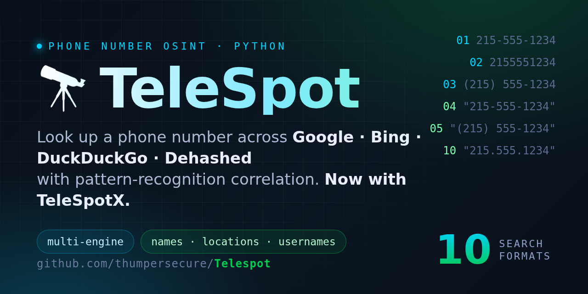

<div align="center">

<!-- Social preview -->


# 📞 telespot

```
  _       *      _                     _   *
 | |_ ___| | ___  ___ _ __   ___ | |_
 | __/ _ \ |/ _ \/ __| '_ \ / _ \| __|*
 | ||  __/ |  __/\__ \ |_) | (_) | |_
  \__\___|_|\___||___/ .__/ \___/ \__|
*                    |_|    *   v5.2.0
```

[](https://github.com/thumpersecure/Telespot)

[](https://www.python.org/)
[](LICENSE)
[](https://github.com/thumpersecure/Telespot/stargazers)
[](https://github.com/thumpersecure/Telespot/network)

**Telespot** is a powerful Python-based OSINT tool that investigates phone numbers across multiple search engines. It searches each number in **10 format variations** and correlates results to surface **names**, **locations**, and **usernames**.

[Getting Started](#-quick-start) •
[Features](#-features) •
[Usage](#-usage) •
[API Setup](#-api-setup) •
[Case Study](CASE_STUDY.md) •
[Support](#-support)

</div>

---

## 🚀 Quick Start

Get up and running in under 2 minutes:

```bash
# 1️⃣ Clone the repository
git clone https://github.com/thumpersecure/Telespot.git
cd Telespot

# 2️⃣ Set up virtual environment (recommended)
python3 -m venv telvenv
source telvenv/bin/activate

# 3️⃣ Install dependencies (requests, brotli, httpx)
pip install -r requirements.txt

# 4️⃣ Configure your API keys
./telespot.py --setup

# 5️⃣ Run your first search!
./telespot.py 8885551212
```

> 💡 **Tip:** No API keys? No problem! DuckDuckGo works without any setup.
> DuckDuckGo does, however, sometimes answer scripted clients with a bot challenge. A free Google or Brave key gives reliable results.

---

## 🆕 What's New in 5.2.0

This release fixes the bugs that made searches come back empty or misleading:

| Fix | What was wrong |
|-----|----------------|
| 🦆 **DuckDuckGo works again** | The Instant Answer API now replies with HTTP 202, which the tool rejected. DuckDuckGo's HTTP 202 bot-challenge page is now detected and reported instead of silently returning 0 results. After two challenges in a row the web fallback is skipped so a run does not waste minutes in backoff. |
| 🗜️ **Compressed replies decoded** | Requests advertised brotli compression without a decoder, so servers sent bodies the tool could not read. `br` is only advertised when the `brotli` package is installed (now in `requirements.txt`). |
| 🚫 **No more false captcha hits** | Words like *blocked*, *forbidden* and *access denied* appear in ordinary spam-call listings and used to trigger the captcha detector, which backed off and discarded real results. Detection now keys on real challenge markers only. |
| 🔑 **API errors are shown** | An invalid or unenabled Google key returned 403, which was treated as a captcha and retried for 15+ seconds per format. All API errors (Google, Brave, Dehashed) now print the provider's message once. |
| 🔁 **Retries keep credentials** | Retries used to regenerate headers and drop the Brave subscription token and Dehashed key, turning every retry into a 401. |
| 📊 **Counts are real** | Locations and usernames were de-duplicated before counting, so every count was 1 and ⭐ indicators and confidence scores never worked. |
| 🌍 **International formats** | Non-US numbers were searched as `+1…`. The `-c` country code is now used, and a country code typed into the number is not doubled. |

---

## ✨ Features

| Feature | Description |
|---------|-------------|
| 🔍 **4 Search APIs** | Google, Brave, DuckDuckGo, and Dehashed (optional) |
| 📱 **10 Phone Formats** | Dashes, digits, parentheses, international, quoted variants |
| 🧠 **Pattern Analysis** | Extracts names, locations, usernames with confidence scoring |
| 🛡️ **Anti-Detection** | User-agent rotation (13 profiles), adaptive delays, accurate bot-challenge detection |
| 🎨 **Output Options** | Verbose, colorful rainbow mode, JSON/TXT export, summary charts |
| 🌍 **International** | Support for country codes worldwide |
| ⚡ **Fast Mode** | TelespotX for parallel requests (US only) |

---

## ⚡ TelespotX (Fast Mode)

Need **maximum speed**? Use `telespotx.py` (v0.4.0) for parallel requests with no rate limiting:

```bash
pip install httpx brotli
./telespotx.py 8885551212        # ⚡ ~5 seconds vs ~60 seconds
```

| | 🐢 telespot.py | ⚡ telespotx.py |
|---|:---:|:---:|
| **Speed** | ~60s | ~5s |
| **Rate limiting** | ✅ Yes | ❌ No |
| **Formats** | 10 | 6 |
| **Region** | 🌍 International | 🇺🇸 US only |
| **Library** | requests | httpx |

---

## 📖 Usage

### Basic Commands

```bash
./telespot.py 8885551212              # 🔍 Basic search
./telespot.py 8885551212 -v           # 📝 Verbose output with URLs
./telespot.py 8885551212 --colorful   # 🌈 Rainbow color mode
./telespot.py 8885551212 -k "name"    # 🔑 Add keyword filter
./telespot.py 8885551212 -s site.com  # 🌐 Search specific site
./telespot.py 8885551212 --dehashed   # 🔓 Include breach database
./telespot.py 8885551212 -o out.json  # 💾 Save to JSON
./telespot.py +442071234567 -c +44    # 🇬🇧 International number
```

### Configuration Commands

```bash
./telespot.py --setup                 # ⚙️ Configure API keys
./telespot.py --api-status            # 📊 Check API configuration
./telespot.py --update                # 🔄 Update from GitHub
./telespot.py --help                  # ❓ Show help
```

---

## 🎛️ Options Reference

```
🔍 SEARCH OPTIONS
   -k, --keyword    Add search keyword (e.g., "owner", "business")
   -s, --site       Limit to specific site (e.g., whitepages.com)
   -c, --country    Country code (default: +1)
   --dehashed       Include Dehashed breach database

📤 OUTPUT OPTIONS
   -v, --verbose    Show detailed results with URLs
   -o, --output     Save to file (.json or .txt)
   --summary        Show pattern comparison chart
   --dtmf           Show DTMF tone representation

🎨 DISPLAY OPTIONS
   --colorful       Enable rainbow color mode
   --no-color       Disable all colors

⚙️ CONFIGURATION
   --setup          Interactive API key setup wizard
   --api-status     Show current API configuration
   --update         Update Telespot from GitHub
   -d, --debug      Enable debug output
```

---

## 🔑 API Setup

### Quick Setup

Run the interactive setup wizard:

```bash
./telespot.py --setup
```

### API Free Tiers

| API | Free Tier | Signup |
|-----|-----------|--------|
| 🔵 **Google Custom Search** | 100 searches/day | [Get Key](https://developers.google.com/custom-search/v1/introduction) |
| 🟢 **Brave Search** | ~2,000 searches/month | [Get Key](https://api.search.brave.com/) |
| 🟠 **DuckDuckGo** | ♾️ Unlimited | No key needed! |
| 🔴 **Dehashed** | Paid | [Sign Up](https://dehashed.com/) |

> 📘 **Need detailed instructions?** See [GUIDE_APIS.md](GUIDE_APIS.md) for step-by-step API setup.

---

## 📁 Config File

Your API keys are securely stored in `~/.telespot_config`:

```ini
# 🔵 Google Custom Search API
google_api_key=YOUR_GOOGLE_API_KEY
google_cse_id=YOUR_CUSTOM_SEARCH_ENGINE_ID

# 🟢 Brave Search API
brave_api_key=YOUR_BRAVE_API_KEY

# 🔴 Dehashed API (optional)
dehashed_api_key=YOUR_DEHASHED_V2_API_KEY
```

> 🔒 **Security:** Config file permissions are set to `600` (owner read/write only).

---

## 🎯 Example Output

```
📞 Searching for: 8885551212
🌍 Country code: +1
📊 Using 10 format variations

[1/10] Searching: 888-555-1212
  → Google API... (8 results)
  → Brave API... (10 results)
  → DuckDuckGo... (2 results)
  ✅ 20 total for this format
  ⏳ Rate limit: 4.2 seconds

══════════════════════════════════════════
📊 PATTERN ANALYSIS SUMMARY
══════════════════════════════════════════

🎯 Confidence Score: HIGH (78%)

👤 Names Found:
   • John Smith: 12x ⭐
   • Jane Doe: 3x

📍 Locations:
   • Philadelphia, PA: 15x ⭐
   • PA: 10x

🔗 Usernames:
   • @johnsmith: 3x ⭐
══════════════════════════════════════════
```

---

## 🛠️ Troubleshooting

<details>
<summary>❌ No results found</summary>

1. Check API status: `./telespot.py --api-status`
2. Verify API keys are valid (a bad Google key now prints Google's own error message)
3. Try with `--debug` to see API responses
4. DuckDuckGo Instant Answers only works for well-known topics
5. Make sure `brotli` is installed (`pip install -r requirements.txt`)

</details>

<details>
<summary>🦆 "DuckDuckGo answered with a bot challenge"</summary>

DuckDuckGo serves a picture challenge (HTTP 202) to clients it does not trust, especially from
cloud, VPN or shared IP addresses. Telespot detects it, reports it once, and after two challenges
in a row skips DuckDuckGo's web search for the rest of the run.

- Wait a while or switch networks and try again
- Configure a free Google or Brave key, which are not affected

</details>

<details>
<summary>⚠️ API quota exceeded</summary>

- **Google:** 100/day, resets at midnight UTC
- **Brave:** ~2,000/month, resets monthly
- **DuckDuckGo:** No limits (but limited result types)

</details>

<details>
<summary>🔌 Connection errors</summary>

- Check your internet connection
- Use `--debug` to see detailed error messages
- Some APIs may be temporarily unavailable

</details>

---

## 👏 Credits

Created with ❤️ by:

- **Spin** ([@thumpersecure](https://github.com/thumpersecure))
- User-Agent rotation concept from [@kaifcodec](https://github.com/kaifcodec)

---

## 📄 License

This project is licensed under the **MIT License** - see the [LICENSE](LICENSE) file for details.

---

<div align="center">

⚠️ **Disclaimer:** This tool is intended for **legitimate OSINT purposes only**. Users are responsible for ensuring their use complies with all applicable laws and regulations.

**Made with 🔍 for the OSINT community**

</div>
